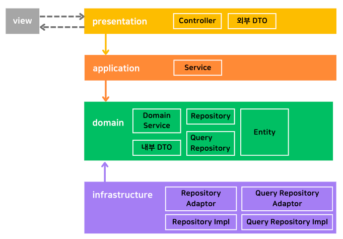

# java-api-server

### 🔥 개요

- `도메인 주도 개발 시작하기` 도서를 학습한 내용을 기반으로 프로젝트를 구현했습니다.

### 🔥 프로젝트 구현 내용 포스팅

- 💡 [@TransactionalEventListener 비동기 이벤트 처리 하기](https://yoonseon.tistory.com/154)
- 💡 [DIP를 적용하여 리팩토링 해보기](https://yoonseon.tistory.com/153)
- 💡 [@RequiredArgsConstructor와 @AllArgsConstructor 비교하기](https://yoonseon.tistory.com/152)

### 🔥 아키텍처

### 🔥 패키지 구성

root  
⎿ api  : 도메인별 계층 구조  
⎿ web  : 전역 설정 및 유틸형 클래스  
⎿ infra  : 외부 서비스 통신 모듈

### 🔥 구현 내용

- `JWT` 로그인 인증 인가
- 회원 본인만 호출할 수 있는 API 내부의 요청된 회원 ID가 본인의 ID인지 검증하는 로직을 `AOP`로 분리
- `@Async` + 스프링 이벤트 리스너를 활용한 회원가입완료, 비밀번호 초기화 이메일 전송
- `MapStructure`를 활용한 DTO 간 오토 캐스팅